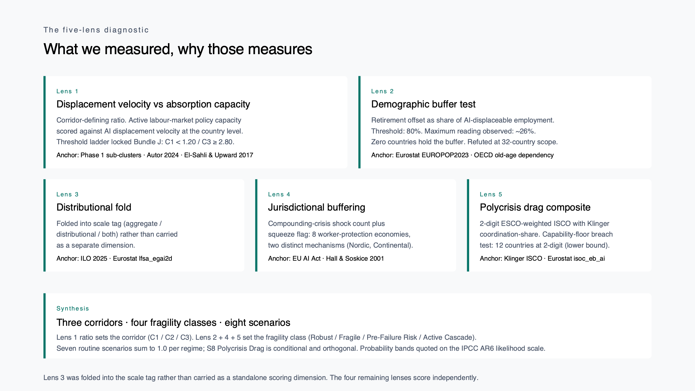
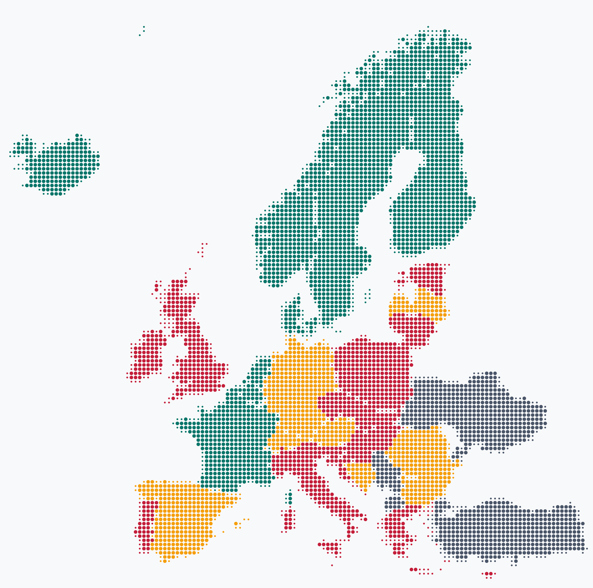
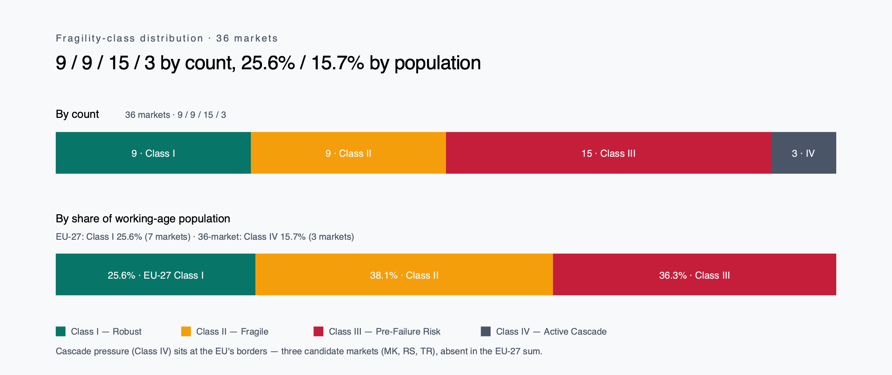
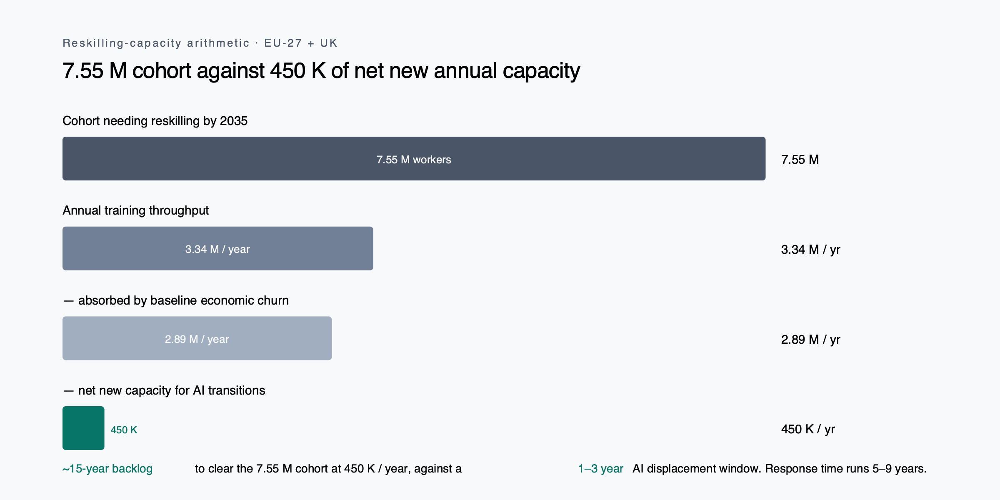

<!-- COVER: No European labour market is fully safe from AI-driven job displacement. -->

# European AI Labour Market Synthesis — A Long Read

*Part 6 of 7 in the European AI Labour Market suite. By Philipp Maul · Nexalps · April 2026.*

---

### At a glance

| Markets scored | Class I — Robust | Capability-floor breach | Reskilling gap |
|---|---|---|---|
| **36** | **9** | **12** | **15 yrs** |
| EU-27 + EFTA-4 + UK + 4 candidates | Under softer rule. Strict rule: 0. | Countries below adaptive-capacity floor | 7.55 M need / ~450 K net new annual |

We stress-tested 36 markets across five lenses and eight scenarios. Most countries can absorb the disruption only partially, and 15 are likely already beyond that threshold. Under the rules we applied, only nine have the statistical strength to hold up under pressure.

This document is the long read. It tells the story behind a corridor map of 36 European labour markets — what we measured, why those measures, where the picture turned, what fell out, and what the result means for boards and policy desks now reading European AI exposure as a single number.

Based on 59 primary sources including Autor 2024 (QJE), Cedefop 2025, Draghi 2024, the European Climate Risk Assessment, Eurostat EUROPOP2023, the Rhodium / MIT Clean Investment Monitor, and OECD Pension Markets in Focus 2025.

---

## 1. Why the historical safety net is unraveling

European AI labour-market projections circulate in three registers. Vendor reports keyed to compute spend and adoption surveys. Macro forecasters working from historical reinstatement base rates. Political communications keyed to active labour-market commitments and reskilling envelopes. None of the three takes seriously, at the same time, that the historical reinstatement base rate has weakened (Autor, Chin, Salomons & Seegmiller, QJE 2024), that demographic buffering across Europe is empirically too thin to absorb mid-skill displacement, that institutional bandwidth is being contested by concurrent crises (defence, climate, Ukraine, EU budget mid-cycle reinforcement), and that coordination-share heterogeneity within the "high-coord" economies cuts in opposite directions once you go past 1-digit averages.

The synthesis is a corridor map across all 36 European labour markets, scored under five lenses (displacement velocity, demographic buffer, distributional fold, jurisdictional buffering, polycrisis drag), folded into three corridors (Managed Transition, Partial Absorption, Displacement Without Absorption), bracketed by four fragility classes (Robust, Fragile, Pre-Failure Risk, Currently Failing), and stress-tested against eight scenarios (seven routine variants plus one conditional polycrisis cascade). Every country is tagged with regime (growth-baseline, secular-stagnation-warning, post-growth-empirical), scale (aggregate, distributional, both), and a capability-floor breach flag (12 countries). Probabilities are quoted as IPCC AR6 likelihood-scale band ranges, not point estimates.

We picked the five lenses because earlier parts of the project had already assembled the evidence: AI exposure, demographics, disruption pathways, reskilling capacity, careers data. The constraint was not which lenses might exist in theory. It was which ones we could test rigorously today, with European data, across 36 countries. Lens 1 measures displacement velocity against absorption capacity; the ratio defines which corridor a country sits in. A ratio of 1.00 means the two are running at the same pace; 2.80 means displacement is running at 2.8× absorption. Norway 1.06 sits well-absorbed; Ireland and the UK at 3.33–3.40 show displacement materially outpacing absorption. Lens 2 asks whether retirement attrition can absorb the displaceable cohort. Lens 3 folds into the scale tag (aggregate, distributional, both) rather than carry a separate dimension. Lens 4 counts compounding shocks and flags jurisdictional squeezes. Lens 5 composes a polycrisis drag at 2-digit ESCO weighting, with a capability-floor breach test that asks whether institutions can routinely absorb the kind of labour-market shocks the scenarios describe.

The audience is senior policy and advisory readers — board members, executive-search principals, lecture-room participants — who need a citable single-document anchor that survives interrogation by a country specialist *and* by a structural-bias critic. Earlier parts of the project (Phases 1 through 3) shipped the reproducible scoring artefacts: CSVs, JSON, methodology notes. This part ships the result. Which corridor, which class, which scenario, with which probability band, under which regime, with what is and is not central to the analysis flagged inline.

---

## 2. Three corridors, not one — and where each country lands

The corridor map sorts 36 European labour markets into three corridors based on how well their training and re-employment systems can keep up with AI-driven displacement. Green markets are coping. Amber markets are at risk. Red markets are already behind.

Five countries sit in C1 Managed Transition (Lens 1 ratio under 1.20): Denmark, Finland, Iceland, Norway, Sweden. Sixteen sit in C2 Partial Absorption (1.20–2.80): Austria, Bosnia and Herzegovina, Belgium, Bulgaria, Switzerland, Germany, Spain, France, Liechtenstein, Luxembourg, Latvia, North Macedonia, Netherlands, Romania, Serbia, Turkey. Fifteen sit in C3 Displacement Without Absorption (≥ 2.80): Cyprus, Czechia, Estonia, Greece, Croatia, Hungary, Ireland, Italy, Lithuania, Malta, Poland, Portugal, Slovenia, Slovakia, United Kingdom. The map projects on Web Mercator with country geometry from Natural Earth 1:50m. Each country is rendered as a cluster of dots; dot size encodes outline fidelity (smaller dots feather coastlines and narrow regions, larger dots fill country interiors), not data. Colour carries the corridor and class signal.

The C1 corridor is narrower than the historical literature suggests once the 1.20 cap is applied. The next sub-cluster begins at 1.59, leaving an empirically empty band between the Nordic edge and the Continental knowledge economies. C2 carries four within-corridor sub-clusters: Continental Corporatist (BE, FR, LU, NL — three of which carry the squeeze flag); Germanic Dual (AT, CH, DE, LI — all post-growth or post-growth-proxied); Southern European in C2 (Spain alone, just below the C3 floor); and Central / Eastern European in C2 (BA, BG, LV, MK, RO, RS, TR). C3 carries two sub-clusters: Liberal Market high (Ireland and the United Kingdom at ratio 3.33–3.40, weak active labour-market policy plus high knowledge-economy concentration) and CEE / Mediterranean weak-ALMP (the remaining 13, ratio 2.81–2.96). El-Sahli & Upward 2017 supplies the empirical anchor for structural lifetime-earnings deficits in C3.

### Italy — the workforce shrinks before AI displaces a single worker

Italy is the only major European economy with negative net migration in 2025. Institutional ageing has crossed from buffer-deficit into accelerating decline; the workforce is contracting on its own, before AI substitutes for any task. Working-age population trajectory: −17.5 % to 2050 (sharpest-decline tier). Retirement offset 25.3 %, well below the 80 % buffer threshold. Migration-dependence is acute but politically constrained, while unfillable shortages in care, trades, and healthcare amplify rather than absorb displacement. Italy sits in Class III, secular-stagnation regime, with the parallel-cascade scenario carrying a 0.10 conditional weight. Net migration 2025: **−485,823**.

---

## 3. Counts hide what populations reveal — Class IV is 16% of workers on three markets

By count, the 36 markets split 9 / 9 / 15 / 3 across the four fragility classes (Robust, Fragile, Pre-Failure Risk, Currently Failing). The headline three-quarters-in-uncomfortable-territory finding rests on that count. Population-weighting changes the picture. Class I covers about 25.6 % of EU-27 working-age population on 7 markets. Class IV covers about 15.7 % of 36-market population on just 3 markets. The headline numbers compress and extend depending on which weighting you take.

The population-weighted view of the EU-27 alone is more comforting than the country-by-country view: on a population-weighted average, the EU-27 looks like it is coping. The cascade pressure does not appear if you sum within the EU-27 borders. Add the four EU candidate countries (Bosnia and Herzegovina, North Macedonia, Serbia, Turkey) and three appear in Class IV. The frame shifts. Cascade risk sits at the EU's borders, not within them. It sits in the markets the EU is still deciding whether to bring in.

The within-EU-27 view also hides a regime split worth surfacing. Almost 40 % of EU-27 workers live in countries whose economies have stopped growing in the conventional sense: Germany, France, Austria, Sweden, Finland, Luxembourg. In those countries, the comforting story "old jobs disappear, new ones appear at the same rate" breaks down. Output is not expanding to make room for new jobs. What can work for nearly 40 % of EU-27 workers is redirecting them into climate-adaptation jobs that grow as Europe decarbonises. For that population share, the optimism path runs through climate, not conventional tech.

> "There are no unconditionally robust European labour markets at the 1.20 cap, only conditionally robust ones."

The strongest validation of the structural-bias warning embedded in the framework arrived not as a confirmation of any positive prediction, but as a strict-zero result on the Class I count across the entire 36-country panel. Bundle J replaced the Phase 1 thresholds (C1 < 1.50, C3 ≥ 3.00) with the theory-anchored 1.20 / 2.80 pair. Three independent anchors converged on the new values. (i) Phase 1 sub-cluster boundaries: the Nordic cluster ends at 1.10, the next cluster begins at 1.59, leaving the empirically empty band where the Phase 1 cap had floated. (ii) Autor et al. QJE 2024: reinstatement-effect weakening, which lowers the historical-base-rate-derived ceiling on "managed transition." (iii) El-Sahli & Upward 2017 NDLS: structural lifetime-earnings deficits among displaced workers in C3-equivalent regimes. Under the literal-strict (b) ±0 rule applied to the new thresholds, Class I dropped to zero. Even the spec-anchor Nordics failed strict robustness. The fix was the relative-stable rule with the Q1 asymmetric-guard lock: Class I = ±1 of baseline AND no routine variant reaches C3. Class I restored to 9 (the five Nordics plus Belgium, France, Luxembourg, the Netherlands). The strict-zero finding survives in the methodology trail not as a failed test but as the structural-bias headline. Published "managed transition" base rates over-state robustness. There are no unconditionally robust European labour markets at the 1.20 cap, only conditionally robust ones (relative-stable, C3-guarded).

The demographic-orthogonality finding folds back into the same picture. Lens 2 was tested against the locked-spec threshold: a country `buffer_holds` if the retirement-offset (annual cohort exit through retirement as a share of AI-displaceable employment) exceeds 80 %. Across 32 scored countries, the maximum reading observed is approximately 26 % (the Greece, Croatia, Bulgaria, Lithuania, Latvia, Malta cluster). Zero countries meet the threshold. The "silver-lining ageing" argument fails empirically for all 36 countries. Retirement attrition does not absorb the AI-displaceable cohort. The buffer thesis is decisively refuted at 32-country scope, under the threshold the spec itself locked.

---

## 4. The reskilling arithmetic doesn't add up

The 15-country Class III diagnosis rests on a central capacity calculation. Across EU-27 plus the United Kingdom, the deep-reskilling cohort by 2035 is approximately **7.55 million workers**. Annual training-system throughput across all channels (university adult learning, vocational education and training apprenticeships, corporate learning and development, government active labour-market policies, bootcamps, microcredentials) is approximately **3.34 million per year**. Most of that is consumed by baseline economic churn. About 2.89 million per year, calculated from the Eurostat tenure-under-1-year proxy (lfsa_etpgan), is people moving between jobs in normal labour-market turnover. That leaves approximately **450,000 of net new annual capacity** available for AI transitions. Divided into the 7.55 million cohort, the implied backlog is **15 years**.

That 15-year backlog runs against an AI-vs-system speed gap of **5–9 years**. AI disrupts in 1–3 years for clerical, customer-service, writers and translators, and similar Zone A occupations. European vocational education and training systems and university channels respond in 5–9 years. Even allocating disproportionately to Class III absorbs only marginal share of the deficit without channel expansion.

> "The arithmetic is unforgiving in two ways at once."

The arithmetic is unforgiving in two ways at once. First, the absolute capacity gap. There is no allocation rule that reshuffles 450,000 net new annual slots across 7.55 million displaceable workers and produces a 1-to-3-year resolution. Second, the dynamic gap. Even if you could expand capacity, the response curve of European training systems is slower than the AI displacement curve. The combination is what bites: capacity that is neither sufficient in stock nor fast in flow.

This is the quantitative spine of the Class III diagnosis. The countries already in the worst corridor are not there because their workers are uniquely vulnerable. They are there because the speed at which their training systems can deep-reskill workers is slower than the speed at which AI displaces them. That structural mismatch holds independent of which routine scenario realises. It is the reason the 15-country C3 group cannot be pulled out with marginal reform.

A reader might ask whether the channels listed under "training throughput" are the right ones; whether bootcamps and microcredentials should sit alongside the formal vocational education and training system in the same accounting. The choice was deliberate. Anything that delivers a recognised credential or workplace-accepted skill in a window of weeks to months counts toward absorption capacity. Excluding bootcamps and microcredentials would not improve the picture. It would worsen it. The 3.34 million figure is the optimistic cap, not a conservative one.

---

## 5. Eight scenarios, and the one most likely depends on whether the economy is still growing

The next decade plays out for European labour markets across eight scenarios, not one. Each is a self-contained what-if: a coherent story of how AI, demographics, and institutions interact over ten years. Seven sit on an optimism-pessimism spectrum and are mutually exclusive; their probabilities sum to 1.0 within each economic regime. The eighth is a parallel-cascade pattern that can be triggered alongside any of the routine seven.

The seven routine variants run from uber-optimistic to pessimistic. **S1 Reinstatement Revival** has the historical "old jobs disappear, new jobs appear" pattern fully holding; new occupations absorb displaced workers at the historical rate. **S2 Climate Adaptation Boom** redirects sectoral activity into climate-adaptation work, with new demand in healthcare, trades, and the green economy absorbing displacement. **S3 Jobs Transform** has AI substituting for routine tasks within existing occupations; jobs reshape and wages stay stable or rise modestly (Brynjolfsson, Li & Raymond 2023; Dell'Acqua et al. 2023; the Nielsen forklift framing). **S4 Muddle Through** involves only attrition and partial reabsorption, with no sharp pattern either way. **S5 Wage Cliff** has AI substituting for mid-skill labour, and wages compress because reinstatement creates fewer or lower-paid jobs. **S6 Reinstatement Failure** weakens the historical reinstatement mechanism (Autor 2024); new occupations form, but at a rate too slow to absorb displacement. **S7 Bandwidth Fracture** sees training and re-employment systems collapse under parallel-crisis overstretch.

Then **S8 Polycrisis Drag** sits off the spectrum on purpose. It is a parallel-cascade pattern: defence rearmament, EU-budget strain, climate adaptation pressure, global decoupling, and Ukraine reconstruction overwhelm institutional capacity simultaneously.

> "There is no analogue in the 580 years of historical disruptions reviewed earlier in this analysis."

This combination has no analogue in the 580 years of historical disruptions reviewed earlier in this analysis. There is no clean historical case base to ground the joint dynamics, which is why we treat S8 as a conditional "parallel risk" rather than the worst point on the routine spectrum.

The probability weight for each routine scenario is regime-conditional. Two countries can be living under the same scenario, and one drifts into trouble while the other absorbs it. The reason is the underlying economic weather. We separate three regimes: growth-baseline (24 countries, including the 4 candidates), secular-stagnation-warning (Greece, Italy), post-growth-empirical (10 countries: Austria, Switzerland, Germany, Finland, France, Liechtenstein, Luxembourg, Norway, Sweden, the United Kingdom). The same shock translates into different odds depending on which regime.

The post-growth column carries the modal-finding: P(S2 | post-growth) = **0.30** [80 % CI 0.20–0.38], the highest probability of any of the seven routine scenarios in that regime. P(S1 | post-growth) drops to **0.05**. The standard tech-led-recovery story (S1 + S3 combined) collapses from about 20 % under growth-baseline to about 13 % under post-growth. **S5 Wage Cliff** holds 0.13–0.15 across regimes — not the dominant scenario in any regime, but the scenario whose probability mass is least sensitive to regime change. **S8** is a conditional and rises with regime severity: 0.05 under growth-baseline, 0.10 under secular-stagnation-warning, 0.15 under post-growth-empirical.

For three countries (Austria, Luxembourg, Turkey) only S2 lands them in C1 Managed Transition. All six other routine variants produce C2 or C3. The implication is sharp: published transition narratives that assume tech-led S1 reinstatement miss that, for these countries, the tech-led path is closed. Their best routine outcome runs through redirecting workers into climate-adaptation demand (healthcare, trades, the green economy). Anchored on Cedefop 2025 country-level employment projections plus the EU Net-Zero Industry Act €100 B clean-manufacturing envelope. Under post-growth (Austria, Luxembourg), S2 is also the modal routine variant (the dominant probability mass) and the only genuinely-positive scenario surviving the regime check. Conditional on works-council mediation and procurement-attached social conditionalities (ETUC; IndustriAll Europe).

The cross-tab between corridor and class adds a final discipline. All five C1 countries are Class I. Of 16 C2 countries: 4 are Class I (Belgium, France, Luxembourg, Netherlands, all squeeze-flagged Continental Corporatist), 9 are Class II (AT, BA, BG, CH, DE, ES, LI, LV, RO), 3 are Class IV (MK, RS, TR). All 15 C3 countries are Class III. Class IV does not arise in C1 or C3 in the routine-variant grid; its three members all sit at C2 baseline because their candidate-partial-coverage readings do not push the Lens 1 ratio into C3 directly. The cascade signal arrives via Lens 4 and Lens 5 extremes.

Ukraine carries separately as the Class IV reference panel. Lens 5 inputs at maxima: military expenditure 40 % of GDP (SIPRI 2025: USD 84.1 bn, 2024); demographic collapse from refugee outflow plus war casualties; reskilling infrastructure war-damaged. Ukraine is not corridor-mapped. The Layer 1 / 4 / 5 backporting required for corridor-map participation would consume 2–3 weeks of fetch-and-score work, and the analytical value of that work is dominated by the panel role Ukraine already serves. Ukraine calibrates the upper bound of the Lens 5 polycrisis composite. The three corridor-mapped Class IV countries (MK, RS, TR) sit below the Ukraine ceiling on Lens 5 readings, which is the reason the rule produces three rather than zero or thirty.

---

## 6. Three candidate scenarios tested; none held up alone

We tested three candidate additions to the eight-scenario stack. None held up on its own.

The EU Industrial Accelerator Act, proposed in March 2026, looked like a candidate ninth scenario. On close inspection, it runs the same absorption pathway as Climate Adaptation Boom: state-coordinated sectoral demand, with workers pivoting into new sectors. The US Inflation Reduction Act, three years post-implementation, confirms the mechanism class. The Industrial Accelerator Act is a strengthening of S2, not an independent scenario.

We tested whether the wealth-fund-rich economies (Norway, Sweden, Denmark, the Netherlands, with Switzerland adjacent) deserved their own regime. Pension and sovereign-wealth differences are real, but the per-country threshold did not hold cleanly across all five candidates. Switzerland's central-bank reserves do not behave like Norway's sovereign wealth fund, so the line between "wealth-fund rich" and "post-growth" could not be drawn consistently. We dropped the candidate regime and kept the three-regime split.

A third test asked whether startup-driven absorption (Europe's gap relative to the US in venture-scale firm formation) warranted its own scenario. ECB analyses document the gap clearly, and examples from other regions suggest the mechanism is possible. But each existing scenario in this taxonomy rests on something concrete: Cedefop's per-country employment projections, the Net-Zero Industry Act's committed €100 billion, the Inflation Reduction Act's three years of realised data. Startup-driven absorption in Europe has no equivalent anchor yet. Without a comparable anchor, it cannot be probability-weighted alongside the others.

The three rejections rest on different reasoning, but the takeaway is the same. Going forward, more than one of these mechanisms likely has to work at the same time: climate-led sectoral pivot, industrial-policy demand, wealth-fund buffering, startup formation, and the within-occupation reshape already in the taxonomy. The quantitative anchors for the multi-mechanism case sit in Phase 5+ and are out of scope for this synthesis.

Three known gaps constrain the analysis. First, occupational detail. The capability-floor breach is reported at 2-digit ISCO because the finer-grained European Social Survey microdata (3-digit) requires a multi-week application. The 12-country breach count is a lower bound. Second, EU MFF allocation. The €64.6 B MFF mid-cycle reinforcement is not disaggregated per Member State in publicly available Council documentation. Lens 5 captures the bandwidth tax at the EU aggregate level (its existence *is* the political-economy signal), but the per-country share is null by design. Third, employer behaviour. We cannot observe live signals like hiring, retraining launches, or redundancy plans because they sit behind paywalls or in proprietary HR systems.

A scope note on the country panel itself. The 36-market panel covers the EU-27, the four EFTA states (CH, IS, LI, NO), the UK, and four EU candidate countries with sufficient data coverage to participate in the lens framework (BA, MK, RS, TR). Five other European countries are explicitly out of scope: Albania, Montenegro, and Moldova — EU candidates (since 2014, 2010, and 2022 respectively), but Eurostat / Cedefop / ESCO coverage is too thin to score reliably across all five lenses; Kosovo, whose partial-recognition status and Stabilisation and Association Agreement do not change the data-coverage gap that blocks inclusion; and Belarus, under EU sanctions since 2020, with no EU integration path and no comparable data access, excluded on both grounds. When coverage in these five improves to the resolution this framework requires, they can be added without changing the methodology.

These constraints are the reason Part 7 of this project (the response document, scoped separately) cannot be assembled from the corridor map alone. The map says where the pressure is. The response document has to sit on what becomes possible when you add the live behavioural signal the synthesis cannot read.

---

## 7. What survives, and what comes next in Part 7

Forecasts are easy. Stress-tests are uncomfortable, because they make visible what comfortable averages conceal. This synthesis sets out where European labour markets stand across thirty-six countries, five lenses, and eight scenarios; under the rules we applied, none are unconditionally safe, and most are already past the absorption threshold of the historical reinstatement model that the published transition narratives still rely on.

That diagnosis is not a forecast. A country's class reflects current policy choices, not a fixed destiny. Job-training capacity, reskilling, EU funding choices, regulation, and fiscal headroom can shift corridor placement, and more importantly the social, economic, and ecological realities those classes describe. Class I markets can focus on preservation. Class II markets face conditional fragilities that can harden or soften depending on the scenario. Class III markets need step-change responses. Class IV markets need containment.

The strict-zero finding demands a response, beyond the diagnosis itself. **What to do comes in a separate document: Part 7 of this project, scoped separately.**

---

## Sources

Full source list with brief and "How informs" lines also published at [synthesis.nexalps.com/sources.html](https://synthesis.nexalps.com/sources.html).

### Tier 1 — 41 primary sources

| Source | How informs |
|---|---|
| Autor, D., Chin, C., Salomons, A., & Seegmiller, B. (2024). New Frontiers: The Origins and Content of New Work, 1940–2018. | QJE 2024. Anchors the reinstatement-effect-weakening claim behind the corrected corridor edges; the primary citation for the S6 Reinstatement Failure scenario. |
| El-Sahli, Z., & Upward, R. (2017). Off the Waterfront: The Long-Run Impact of Technological Change on Dockworkers. | Anchors the C3 Displacement Without Absorption corridor: structural lifetime-earnings deficits among displaced workers. |
| Cedefop (2025). European Skills and Jobs Survey + Skills Forecast 2025. | Country-level employment projections; Zone-A vs Zone-C task-substitution split; baseline for the S2 Climate Adaptation Boom mass. |
| EU Net-Zero Industry Act & Clean Industrial Deal (Feb 2025). | €100 B clean-manufacturing envelope; the wage-positive Zone-C premium that makes S2 the only routine path to C1 for AT, LU, TR. |
| EEA — European Climate Risk Assessment (ECRA) 2024. | Compounding-crisis (Lens 4) component; eea_vuln readings for Class IV cascade signal. |
| Munich Re NatCat 2025 (Europe). | Lens 4 climate-shock count; Tier 1 reinsurance-grade NatCat dataset. |
| IISS Military Balance 2025. | Defence-spending share of GDP; Lens 5 polycrisis-drag input. |
| SIPRI Trends in World Military Expenditure 2025. | Ukraine reference panel anchor (USD 84.1 bn 2024 = 40 % of GDP); Lens 5 upper-bound calibration. |
| EU MFF Mid-Term Review 2024. | €64.6 B reinforcement (Ukraine + migration + emergency + STEP); aggregate-level signal for the Lens 5 bandwidth-allocation proxy. Per-country disaggregation is in the known-limits list. |
| NATO Hague Summit Declaration (June 2025) · ReArm Europe / Readiness 2030. | Defence-spending uplift commitments; Lens 5 institutional-bandwidth tax. |
| Eurostat — EUROPOP2023 + lfsa_etpgan tenure-under-1yr proxy. | Demographic projections; baseline-economic-churn estimate for the reskilling-capacity calculation. |
| Mario Draghi (2024). The Future of European Competitiveness. | European Commission. Strategic anchor for European competitiveness diagnosis. Direct overlap with Lens 5 institutional adaptive-capacity scoring; the productivity-gap framing supports the strict-zero finding (Europe's capacity to absorb structural shocks has degraded versus the US over 20 years). Bridges to Layer 7's Tier 1 framing. |
| Handa, K., Tamkin, A., et al. (2025). The Anthropic Economic Index — observed Claude usage by occupation. | SOC-mapped task-coverage series. Observed AI usage anchor for Lens 1 displacement velocity; the bottom-heavy distribution (4% of occupations show usage on ≥75% of tasks) is the empirical floor for the S3 Jobs Transform scenario. |
| Massenkoff, M., & McCrory, P. (2026). Labor Market Impacts of AI: A New Measure and Early Evidence. | Anthropic Research. Earliest large-sample evidence on AI hiring effects per occupation. Feeds Lens 1 displacement-velocity calibration and the entry-level signal flagged in the L5 Speed-Gap derivation. |
| Tomlinson, K., Jaffe, S., et al. (2025). Working with AI: Measuring the Applicability of Generative AI to Occupations. | Microsoft Research. Capability-ceiling counterpart to the Anthropic observed-usage series; the two together produce the capability-vs-deployment split used for Lens 1 dual-baseline scoring. |
| Eloundou, T., Manning, S., Mishkin, P., & Rock, D. (2023). GPTs are GPTs: Labor Market Impact Potential of LLMs. | Theoretical AI exposure ceiling per occupation (E1+E2 scores). Third index in the Lens 1 triangulation alongside the Anthropic Economic Index and Microsoft Working with AI. |
| Eurostat — Enterprise AI adoption (isoc_eb_ai). | Per-country share of enterprises (10+ employees) using at least one AI technology, 2021–2025. Direct input to per-country Lens 1 displacement-velocity calibration. |
| Eurostat — ICT specialists as share of employment (isoc_sks_itspt). | Country-level ICT-specialist share, 2015–2024. Anchors the ICT-heavy weight (0.157) in the high-coordination cluster split that surfaces the teaching-heavy versus tech-heavy archetype divergence. |
| Eurostat — Employment by ISCO 2-digit (lfsa_egai2d / lfsa_egais). | Backbone employment table for the Klinger 2-digit ISCO coordination-share weighting and for the high-exposure cohort identification feeding Lens 1. |
| OECD Employment Protection Legislation (EPL) Database. | Country-level EPL strictness scores (regular contracts, 0–6 scale). Direct input to Lens 5 jurisdictional-buffering scoring; underpins the worker-protection axis of the eight-country squeeze cluster. |
| Brynjolfsson, E., Chandar, B., & Chen, R. (2025). Canaries in the Coal Mine? Six Facts about AI Employment Effects. | Documents ~13% entry-level employment decline in AI-exposed occupations (Sept 2025 ADP payroll data). Informs the S3-vs-S6 scenario boundary and the speed-gap derivation (AI displacement 1–3 years vs reskilling-system response 5–9 years); strengthens the Lens 1 entry-level signal alongside Massenkoff & McCrory 2026. |
| Brynjolfsson, E., Li, D., & Raymond, L. R. (2023). Generative AI at Work. NBER Working Paper 31161. | RCT in customer-support work showing 14% productivity gain from generative AI assistance, concentrated in less-experienced workers. Direct anchor for the S3 Jobs Transform scenario — within-occupation task augmentation rather than between-occupation displacement. |
| Acemoglu, D., & Restrepo, P. (2020). Robots and Jobs: Evidence from US Labor Markets. Journal of Political Economy. | Local-labour-market displacement evidence anchoring the C3 Displacement Without Absorption corridor. Sister evidence to El-Sahli & Upward 2017 for permanent earnings deficits. |
| Acemoglu, D., & Restrepo, P. (2019). Automation and New Tasks: How Technology Displaces and Reinstates Labor. Journal of Economic Perspectives. | Companion theoretical framework to Autor 2024 reinstatement-effect weakening; underpins the S1 Reinstatement Revival and S6 Reinstatement Failure scenario boundary. |
| Feigenbaum, J., & Gross, D. (2024). Automation and the Fate of Young Workers: Evidence from Telephone Operation. Quarterly Journal of Economics. | Historical evidence on entry-level displacement following automation; calibration anchor for the S6 Reinstatement Failure scenario and the entry-level signal flagged in the speed-gap derivation. |
| Card, D., Kluve, J., & Weber, A. (2018). What Works? A Meta-Analysis of Recent ALMP Evaluations. Journal of the European Economic Association. | Meta-analytic evidence on Active Labour Market Programme effectiveness. Calibrates the absorption-capacity denominator in the Lens 1 ratio and anchors the S7 Bandwidth Fracture scenario when ALMP capacity is crowded out. |
| Dauth, W., Findeisen, S., Südekum, J., & Wößner, N. (2021). German Robots: The Impact of Industrial Robots on Workers. Journal of the European Economic Association. | Country-specific evidence for the Continental sub-cluster mechanism (worker-protection × tech-substitution). Anchors the DE / AT fragility-class assignments and the within-cluster mobility-versus-protection trade-off. |
| Jacobson, L., LaLonde, R., & Sullivan, D. (1993). Earnings Losses of Displaced Workers. American Economic Review. | Foundational earnings-loss estimates for displaced workers. Sister anchor to El-Sahli & Upward 2017 for the C3 corridor lifetime-deficit signal. |
| European Commission (2024). 2024 Ageing Report: Economic and Budgetary Projections for the EU Member States (2022–2070). | Working-age and dependency-ratio projections; cross-feeds Lens 2 demographic-buffer scoring and the Lens 5 fiscal-bandwidth context for defence + climate + migration commitments. |
| OECD — Old-age dependency ratio. | Country-level old-age dependency ratio. Direct input to Lens 2 demographic-buffer scoring and to the retirement-offset calculation that bounds the maximum-buffer reading at ~26%. |
| United Nations Population Division (2024). World Population Prospects 2024. | Global comparator for the European demographic trajectory; provides the EU and per-country baseline projections used as a check on EUROPOP2023 alignment. |
| International Monetary Fund (2026). World Economic Outlook Database. | Country-level GDP and fiscal indicators feeding the Lens 5 defence-spending share and bandwidth-allocation proxy. |
| OECD Economic Surveys: European Union and Euro Area 2025. | Country-level institutional and fiscal capacity assessment. Anchors the Lens 5 cross-country comparison and the post-growth-empirical regime classification (10 markets). |
| Bertheau, A., et al. (2022). The Unequal Consequences of Job Loss across Countries. IZA DP 15033. | Harmonised admin-data 5-year re-employment rates for AT/DK/FR/IT/PT/ES/SE. Direct input to the per-country A→C transition rates underpinning the Lens 1 absorption denominator. |
| OECD — Social Expenditure Database (SOCX), ALMP training-category spend % GDP. | Replaces the withdrawn Eurostat empl_lmp_expsumm series. Per-country ALMP spending intensity feeds the Lens 1 absorption-capacity scoring and the S7 Bandwidth Fracture scenario. |
| Eurostat — Adult Education Survey (trng_aes_100). | Country-level non-formal adult-learning participation. Speed-axis indicator for the per-country reskilling-system radar feeding Lens 1 absorption and the per-country reskilling-capacity gap. |
| Eurostat — Employment rate of older workers, 55–64. | Country-level older-worker employment baseline. Direct input to the Lens 2 retirement-offset calculation and to the demographic-buffer ceiling for each market. |
| Rhodium Group / MIT — Clean Investment Monitor (IRA tracker). | Realised US labour data on state-coordinated industrial buildout; cross-jurisdictional confirmation of the Climate Adaptation Boom (S2) mechanism class. The Q1 2025 fragility footnote ($8 B / 27,000 jobs cancelled) anchors the "mechanism class confirmed, fragility documented" framing in methodology SM 4. |
| Bistline, J., et al. (2024). Power Sector Implications of the Inflation Reduction Act. NBER Working Paper 32168 / Brookings. | Academic anchor for IRA labour-outcome assessment; complements the Rhodium tracker and supports the "three years post-implementation confirms the mechanism class" claim in methodology SM 4. |
| OECD (2025). Pension Markets in Focus 2025. | Per-country pension-asset operationalisation evidence for the Wealth-Fund-Rich regime hypothesis (declined 2026-05-08 on threshold-inconsistency grounds); cited in methodology SM 4 v5 second paragraph. |
| ILO (2025). Generative AI and Jobs: A Refined Global Index of Occupational Exposure. | Third independent AI-exposure index alongside Anthropic and Microsoft. Cross-check on the Lens 1 displacement-velocity ceiling for cross-country deployment-pattern divergence. |

### Tier 2 — 18 supporting sources

| Source | How informs |
|---|---|
| Klinger coordination-share weighting (2-digit ISCO with ESCO occupation counts). | Methodology used to surface the teaching-heavy (weight 0.582) vs ICT-heavy (weight 0.157) archetype split inside the high-coordination cluster. |
| Tooze, A. (Chartbook 130, 2022 · Chartbook 407, 2025). | Framing reference for the framing-vs-mechanism distinction the Lens 5 spec deliberately separates from. |
| Cooke, R. M. (1991). Experts in Uncertainty — structured-elicitation framework. | Methodological anchor for the 80 % CI bands per scenario × regime in the probability vectors. |
| IPCC AR6 Likelihood Scale. | Probability vocabulary (very likely, likely, about as likely as not, unlikely, very unlikely) used in per-country corridor-mass distribution sentences. |
| EU AI Act — Regulation (EU) 2024/1689. | Phased in force August 2025–August 2027. Lens 5 regulatory anchor; underpins the AI-governance hiring intent surfaced in S3 Jobs Transform and the high-risk classification threshold informing per-country compliance bandwidth. |
| Hall, P., & Soskice, D. (2001). Varieties of Capitalism. Oxford University Press. | Institutional-typology framework anchoring the fragility-class taxonomy and the Nordic / Continental / Liberal sub-cluster split inside the eight-country squeeze cluster. |
| Acemoglu, D., & Johnson, S. (2023). Power and Progress: Our Thousand-Year Struggle Over Technology and Prosperity. | Strategic context for technology distribution outcomes; informs the Lens 5 institutional-direction question that distinguishes routine from off-path scenarios. |
| Brynjolfsson, E., Rock, D., & Syverson, C. (2021). The Productivity J-Curve. American Economic Journal: Macroeconomics. | Capability-versus-deployment lag framing; informs the Lens 1 dual-baseline (capability ceiling vs observed usage) and the S3 Jobs Transform within-occupation reinstatement timing. |
| Frey, C. B. (2019). The Technology Trap: Capital, Labor, and Power in the Age of Automation. | Long-run displacement-without-absorption analytical anchor; informs the S6 Reinstatement Failure and S7 Bandwidth Fracture scenarios. |
| Feigenbaum, J., & Gross, D. (2025). Organizational and Economic Obstacles to Automation: A Cautionary Tale from AT&T. Management Science. | Slow-deployment evidence within a single firm and technology cycle; informs the S4 Muddle Through and S7 Bandwidth Fracture scenario timing assumptions. |
| Autor, D., Dorn, D., & Hanson, G. (2013). The China Syndrome. American Economic Review. | Local-labour-market displacement-without-absorption analytical framework; informs the C3 corridor mechanism and the regional-reabsorption gap diagnosed in the C2 Partial Absorption corridor. |
| Bruegel (2025). The Demographic Divide: Inequalities in Ageing Across the European Union. | Cross-country demographic-asymmetry framing. Informs the Lens 2 per-country buffer split and the Italy / Greece secular-stagnation-warning regime classification. |
| OECD (2023). Pensions at a Glance 2023. | Cross-country pension-system comparison feeding the Lens 5 fiscal-bandwidth context and the post-growth-empirical regime classification (10 markets). |
| Allianz Research (2024). European labor markets: Migration matters. | Migration buffer analysis informing the Lens 2 retirement-offset ceiling and the Italy net-migration anomaly (−485,823 in 2025). |
| European Parliament (2025). Displaced Ukrainians: Challenges and Outlook for Integration in the EU. | Migration-bandwidth context for the Lens 4 polycrisis-drag and Lens 5 jurisdictional-buffering inputs; informs the EU MFF Mid-Term Review €64.6 B reinforcement signal. |
| EURES / European Labour Authority (2024). Report on Labour Shortages and Surpluses in Europe 2024. | Sector-level shortage signals informing the Lens 2 labour-buffer scoring and the per-country Zone-A versus Zone-C task-substitution split feeding S2 Climate Adaptation Boom. |
| ETUC (2026). Press release on the EU Industrial Accelerator Act, 2026-03-04. | Labour-side framing of the Industrial Accelerator Act; convergent with IndustriAll Europe on works-council mediation and procurement-attached social conditionalities. Anchors the S2 mechanism-string additive (data.json line 7941). |
| IndustriAll Europe (2026). Article 1450 — Made in Europe 2.0: labour-side reception. | Sectoral-union framing complementary to ETUC; second source for the S2 additive convergence on works-council mediation and procurement-attached social conditionalities. |

---

*Cite as: Maul, P. (2026). Part 6 — European AI Labour Market Synthesis (Long Read). Nexalps. https://synthesis.nexalps.com/. Licensed CC-BY 4.0 (data) + MIT (code).*
